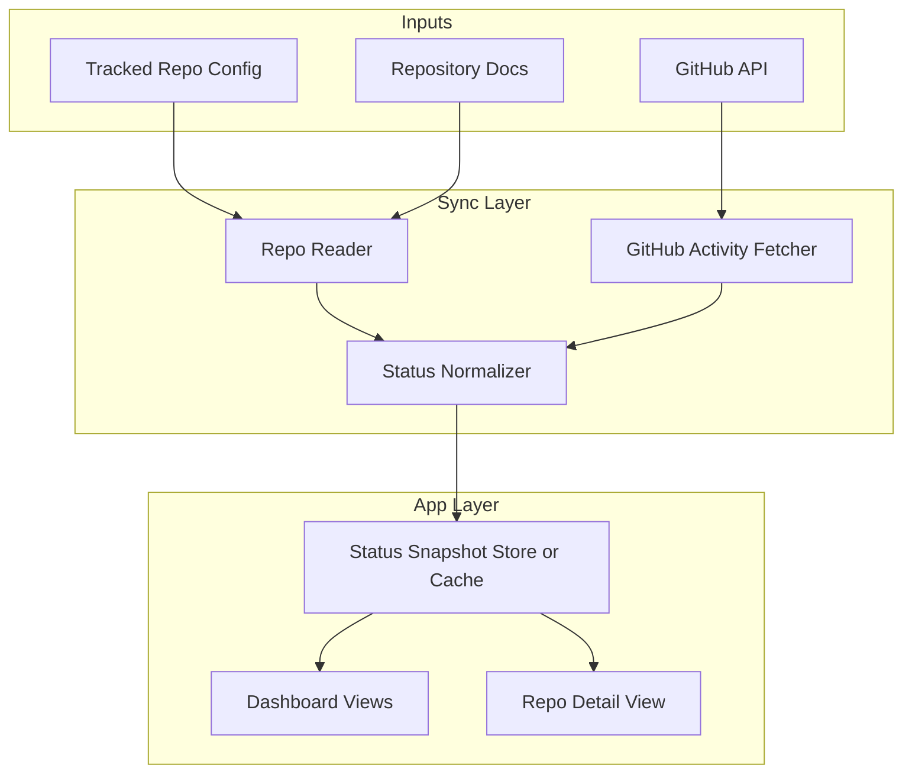

# System Overview

This document describes the planned high-level architecture for Project Manager.

## Architecture Diagram

## Core Components

### Tracked Repo Config

Defines which repositories are included in the dashboard. The v1 model should be explicit and curated rather than discovered automatically.

### Repository Docs Reader

Reads the agreed project files from each tracked repo:

- `README.md`
- `docs/project_charter.md`
- `docs/implementation_schedule.md`
- recent `session_logs/`

The reader should tolerate missing files and expose structured gaps instead of crashing.

### GitHub Activity Fetcher

Collects recent commits, pull requests, and issues for a tracked repo. These signals help answer whether the documented plan is current or stale.

### Status Normalizer

Combines documentation and GitHub activity into one normalized status snapshot. This is the heart of the product and should stay intentionally simple in v1.

### Snapshot Store

Stores tracked repos, latest normalized repo snapshots, and sync run metadata in local SQLite. Tracked repos bootstrap from YAML, but runtime reads come from persisted state so the app survives restarts.

### Dashboard Views

Portfolio-level views let the user scan all tracked repos, filter them client-side, inspect sync freshness, and identify which repos need attention.

### Repo Detail View

Shows the evidence behind a repo summary: parsed doc fields, recent GitHub activity, and any missing or stale inputs.

## Design Principles

- Documentation is the primary source of intent.
- GitHub activity is supporting evidence, not the source of truth.
- Missing data should degrade gracefully.
- The app should optimize for clarity over completeness in v1.
