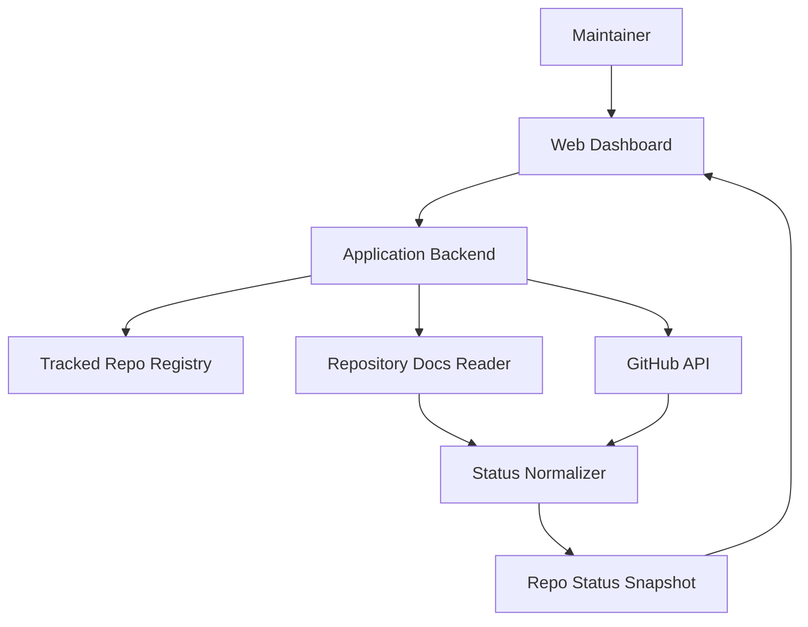

# Project Charter

This document is the working source of truth for product goals, scope, architecture, and decision context.

## Project Overview

**Project Name:** Project Manager

**Vision:** Provide a fast, trustworthy way to understand the current state of selected GitHub repositories by combining the intent captured in project documentation with the evidence visible in recent GitHub activity.

**Technical Goal:** Deliver a usable internal web dashboard that reads repository docs directly, correlates them with GitHub metadata, and presents a normalized repo status view for a curated list of tracked repositories.

**Repository:** https://github.com/connorkitchings/project-manager

## Users and User Stories

### Primary Persona

**Target User:** A maintainer managing several repositories created from the same working template.

- **Role:** Project lead / maintainer
- **Pain Points:** Context is fragmented across READMEs, charters, schedules, session logs, PRs, and issues.
- **Goals:** Quickly see what each project is doing, what changed recently, and which repos deserve attention.

### Core User Stories

As a maintainer, I want a dashboard of selected repos so I can review project status without manually opening each repository.

**Story 1:** As the maintainer, I want to include or exclude repositories explicitly so the dashboard only shows projects I care about.

- Priority: Must-have

**Story 2:** As the maintainer, I want the app to read `README.md`, `docs/project_charter.md`, `docs/implementation_schedule.md`, and recent session logs so the dashboard can summarize the current goal and recent updates.

- Priority: Must-have

**Story 3:** As the maintainer, I want recent GitHub issues, pull requests, and commits alongside documentation summaries so I can compare stated intent with current activity.

- Priority: Must-have

**Story 4:** As the maintainer, I want a detail view for a single repo so I can inspect the evidence behind the summary before making decisions.

- Priority: Should-have

## Features and Scope

### Must-Have (MVP)

**Feature A:** Curated tracked-repository list with include/exclude controls.

- Outcome: The user chooses which repositories appear in the dashboard.

**Feature B:** Documentation parser that extracts a normalized status snapshot from standard repo docs.

- Outcome: The app can display current goal, milestone, recent updates, and blockers when present.

**Feature C:** GitHub activity summary for each tracked repo.

- Outcome: The app can show recent commits, pull requests, and issues as freshness signals.

**Feature D:** Web dashboard and repo detail page.

- Outcome: The user can browse all tracked repos and drill into one repo without leaving the app.

### Should-Have (Post-MVP)

- Stale-project detection
- Attention flags when docs and GitHub activity diverge
- Timeline view that merges session logs with GitHub events
- Optional generated summary artifact for downstream consumption

### Out of Scope for v1

- Organization-wide auto-discovery of repositories
- Multi-user permissions or tenant boundaries
- Writing changes back to tracked repositories
- Full portfolio analytics or executive reporting
- Replacing each repo's own project documentation

## Architecture

### High-Level Summary

Project Manager treats repository documentation as structured product data. For each tracked repo, a sync process fetches a small set of agreed files, reads recent GitHub activity, and normalizes both into a single status model. The web app then renders that status model as dashboard cards and detailed repository views.

### System Diagram

### Architectural Notes

- Start with a curated list of tracked repos instead of discovery.
- Prefer direct reads of repository docs over requiring generated status files.
- Normalize only a small set of fields in v1:
  current goal, status summary, recent updates, last activity, milestone, blockers.
- Persist the latest repo snapshots locally so the app can survive restarts without introducing database-heavy infrastructure.

## Technology Direction

The repository began with template-era Python scaffolding, but the first backend MVP now uses a lightweight Flask service with a YAML repo registry and on-demand sync.

| Category | Working Direction | Notes |
|----------|-------------------|-------|
| Product Surface | Web app | Browser-based internal dashboard |
| Source Integrations | GitHub API + repository file reads | Core inputs for v1 |
| Backend | Flask | Lightweight API layer; CI tests Python 3.10–3.12 |
| Persistence | SQLite | Stores tracked repos, latest snapshots, and sync run metadata |
| Configuration | YAML bootstrap + environment variables | `config/tracked_repos.yaml` seeds tracked repos; env vars provide secrets and runtime config |
| Testing | Pytest | Already present in the repo |
| Documentation | MkDocs | Continue using as project docs site |

## Risks and Assumptions

### Key Assumptions

**Documentation consistency:** Tracked repos will follow a predictable documentation shape close enough to parse reliably.

- Validation: Test the parser against 3-5 repos created from this template.

**Signal quality:** Documentation plus recent GitHub activity will be enough to produce a useful status summary without manual per-repo curation.

- Validation: Compare parsed output with human judgment during early usage.

### Key Risks

| Risk | Probability | Impact | Mitigation |
|------|-------------|--------|------------|
| Repository docs vary more than expected | Medium | High | Define a small required subset and degrade gracefully when fields are missing |
| GitHub activity is noisy or misleading | Medium | Medium | Treat activity as evidence, not the primary status source |
| Template-era code and docs drift apart | Medium | Medium | Keep migration tasks explicit in the schedule and document legacy areas clearly |

## Long-Term Questions

- Should the app eventually consume a canonical generated status artifact instead of parsing docs directly?
- What is the right status taxonomy: healthy, active, blocked, stale, at risk, or something simpler?
- Should the system eventually support organization discovery after the curated-list workflow is proven?

## Decision Log

| Date | Decision | Context / Drivers | Impact / Follow-up |
|------|----------|-------------------|--------------------|
| 2026-04-21 | Treat repository documentation as the primary status source for v1 | Repos built from the same template should expose consistent project context | Define the normalized status model around charter, schedule, README, and session logs |
| 2026-04-21 | Start with a single-user internal web app and curated repo list | Fastest path to a useful first version with minimal auth and discovery complexity | Defer org discovery and multi-user concerns until after MVP |
| 2026-04-21 | Persist backend state in SQLite while keeping YAML as a bootstrap source | The app needs durable repo snapshots without early database/infra complexity | Keep `config/tracked_repos.yaml` for seed data, but serve runtime state from SQLite |
